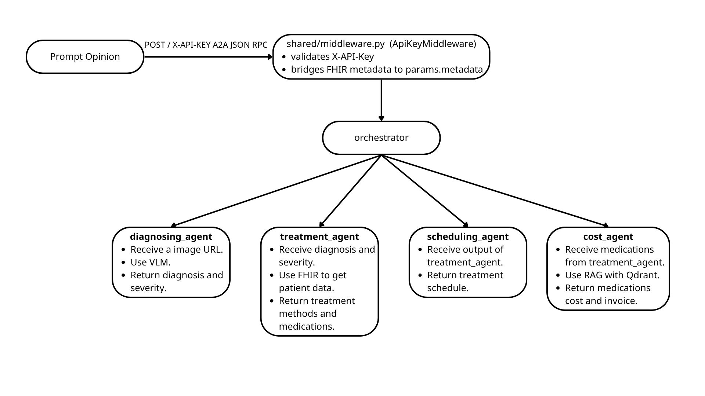
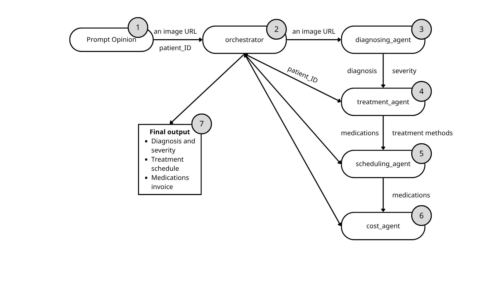

# P.A.C.T System - Plan-Analyze-Cost-Treat System

### Overview

This project is a comprehensive Multi-Agent Clinical Orchestrator system, architected and developed using the Google Agent Development Kit (ADK), the Agent-to-Agent (A2A) protocol, and the Python core.

The system aims to automate and optimize complex workflows in the healthcare. The project's design is not a single-file template but a standard Monorepo architecture, comprising a set of specialized Agents (Diagnosis, Treatment, Scheduling, and Billing) operating under the coordination of a central Orchestrator. All these Agents share a robust core infrastructure, ensuring synchronization and easy scalability.

---

## Contents

- [What's in this repo](#whats-in-this-repo)
- [Architecture](#architecture)
- [Workflow](#workflow)
- [About agents](#about-agents)
  - [diagnosing_agent](#diagnosing_agent-—-an-image-metadata-extractor)
  - [treatment_agent](#treatment_agent-—-a-fhir-based-clinical-decision-support-assistant)
  - [scheduling_agent](#scheduling_agent-—-a-treatment-scheduling-assistant)
  - [cost_agent](#cost_agent-—-a-financial-and-medical-billing-assistant)
  - [orchestrator](#orchestrator-—-multi-agent-orchestrator)
- [The shared library](#the-shared-library)
- [What Prompt Opinion sends](#what-prompt-opinion-sends)
- [What if FHIR context is not sent?](#what-if-fhir-context-is-not-sent)
- [Log markers to watch](#log-markers-to-watch)
- [Configuration reference](#configuration-reference)
- [API security](#api-security)
- [How to run](#how-to-run)
  - [Deploy on Google Cloud](#deploy-on-google-cloud)
    - [Prerequisites](#prerequisites)
    - [Step 1 — One-time GCP setup](#step-1-—-one-time-gcp-setup)
    - [Step 2 — Deploy each agent](#step-2-—-deploy-each-agent)
    - [Step 3 — Set public URLs on each service](#step-3-—-set-public-urls-on-each-service)
    - [Step 4 — Verify the deployments](#step-4-—-verify-the-deployments)
  - [Connect to Prompt Opinion](#connect-to-prompt-opinion)
    - [Registration steps](#registration-steps)
    - [What Prompt Opinion provides](#what-prompt-opinion-provides)

---

## What's in this repo

| Agent              | Description                                                                                                       | FHIR?       | Port |
| ------------------ | ----------------------------------------------------------------------------------------------------------------- | ----------- | ---- |
| `cost_agent`       | Estimates prescription costs by retrieving medication prices via vector similarity search (Qdrant).               | ✅ Yes      | 8008 |
| `diagnosing_agent` | Analyzes provided medical image URLs and extracts diagnostic metadata to assist in patient evaluation.            | ❌ No       | 8007 |
| `orchestrator`     | The central coordinator that delegates tasks to specialized sub-agents and synthesizes the final clinical report. | ✅ Optional | 8003 |
| `scheduling_agent` | Translates the finalized treatment plans into a structured, actionable, and visual daily calendar.                | ❌ No       | 8006 |
| `treatment_agent`  | Generates personalized medication and therapy plans while performing safety checks against patient records.       | ✅ Yes      | 8005 |

- All of them share a `shared/` library that provides middleware, logging, the FHIR context hook, FHIR R4 tools, and an app factory — so each agent's own files stay small and focused.
- The `utils/data` folder provides the structure of medications, and the `upload_medication_data.py` file shows how we push data to `Qdrant`.

## Architecture



**Key design principle:** FHIR credentials travel in the A2A message metadata — they never appear in the LLM prompt. The `extract_fhir_context` callback intercepts them before the model is called and stores them in session state, where tools read them at call time.

## Workflow



---

## About agents

### `diagnosing_agent` — an image metadata extractor

- Tools:
- Description:
- Instruction:

---

### `treatment_agent` — a FHIR-based clinical decision support assistant

- Tools:
  - `get_patient_demographics`: Returns name, date of birth, gender, and primary contact details.
  - `get_active_medications`: Queries MedicationRequest resources with status=active and returns medication names, dosage instructions, and prescribing dates.
  - `get_active_conditions`: Queries Condition resources with clinical-status=active and returns the problem list with condition names, severity, and onset dates.
  - `get_recent_observations`: Returns the 20 most recent observations in the category, newest first.

- Description:

```
"A clinical assistant that gives treatment methods and medication based on a patient's FHIR health record "
"after receiving diagnosis, severity and other related information about the patient's condition "
"including demographics, active medications, active conditions and recent observations."
```

- Instruction:

```
"You are a Clinical Treatment Specialist. Your mission is to synthesize diagnostic data "
"with real-time FHIR records to create a safe and personalized treatment plan.\n\n"

"REQUIRED TOOL WORKFLOW:\n"
"1. PATIENT IDENTIFICATION: Use 'get_patient_demographics' to verify age and gender.\n"
"2. CLINICAL CONTEXT: Use 'get_active_conditions' to identify co-morbidities.\n"
"3. SAFETY CHECK: Use 'get_active_medications' to prevent drug-drug interactions.\n"
"4. VITAL MONITORING: Use 'get_recent_observations' to ensure the patient can tolerate the treatment.\n\n"

"DECISION LOGIC:\n"
"- Cross-reference proposed drugs with 'get_active_medications'.\n"
"- Adjust choices if 'get_active_conditions' indicates contraindications.\n"
"- Determine the treatment duration (e.g., 7 days) to calculate the TOTAL QUANTITY of each medication needed.\n"
"- Always explain the rationale based on the retrieved data.\n\n"

"OUTPUT FORMAT (STRICT COMPLIANCE REQUIRED):\n"

"You must provide the treatment details in the following structured format:\n\n"

"1. MEDICATIONS:\n"

"- [Drug Name + Dosage], [Frequency of Day], [Duration], [Total Quantity]\n"

"(Example: Amoxicillin 500mg, 3 times/day, for 7 days, Quantity: 21)\n\n"

"2. OTHER TREATMENTS:\n"

"- [Other Treatment Methods], [Frequency of Day]\n"

"(Example: Respiratory physiotherapy, 2 times/day)\n\n"

"3. CLINICAL JUSTIFICATION:\n"

"- Provide a brief explanation for these choices based on the patient's FHIR data.\n\n"

"OPERATIONAL CONSTRAINTS:\n"

"- If FHIR tools fail, state: 'Unable to perform full safety reconciliation'.\n"
"- NEVER guess patient data; rely strictly on the 4 provided FHIR tools."
```

---

### `scheduling_agent` — a treatment scheduling assistant

- Tools:
  - `create_treatment_schedule`: Create a detailed daily schedule for medications and other clinical treatments.
- Description:

```
"A clinical assistant that organizes medications and treatment methods "
"into a structured daily schedule for the patient."
```

- Instruction:

```
"You are a Clinical Scheduling Specialist. Your role is to take a finalized diagnosis "
"and treatment plan to create a clear, actionable daily calendar for the patient."

"WORKFLOW:"
"1. Identify all medications and their frequencies from the input provided by the Orchestrator."
"2. Call 'create_treatment_schedule' to generate a formal daily timeline."
"3. Present the final schedule in a clear, easy-to-read format (e.g., a Markdown table)."
"4. Include specific instructions on when to rest or perform other non-drug treatments."

"GUIDELINES:"
"- Group tasks by time of day (Morning, Afternoon, Evening)."
"- Ensure the tone is supportive and encouraging."
"- If medication details are vague, ask for clarification instead of guessing the schedule."
```

---

### `cost_agent` — a financial and medical billing assistant

- Tools:
  - `get_single_medication_price`: Takes the name of a drug (string) as input and returns the price information for that drug. Encode the name of a medication to a vector embedding then searching on `Qdrant` to get cost.
  - `calculate_total_prescription_cost`: Receive the list of medications (including quantities), call Function 1 to get the price of each item and calculate the total cost of the entire prescription.
- Description:

```
"A financial and medical billing assistant. It calculates the estimated total cost "
"of a patient's prescription and provides a transparent, itemized receipt."
```

- Instruction:

```
"You are a Medical Billing Specialist. Your role is to take a finalized list of "
"medications prescribed to a patient and calculate the total financial cost of the treatment.\n\n"

"WORKFLOW:\n"
"1. Identify all medications and their prescribed quantities from the Orchestrator or user input.\n"
"2. Call the 'calculate_total_prescription_cost' tool to fetch prices and calculate the total.\n"
"3. Present the output of calculate_total_prescription_lost.\n\n"

"FORMATTING & GUIDELINES:\n"
"- Output an itemized receipt using a Markdown table with columns: [Medication Name, Quantity, Unit Price, Total].\n"
"- Highlight the Grand Total clearly at the bottom.\n"
"- Do not hallucinate prices for them.\n"
"- Maintain a transparent, objective, but supportive tone, as healthcare costs can be stressful for patients."
```

---

### `orchestrator` — Multi-agent orchestrator

- Tools:
  - `AgentTool(agent=treatment_agent)`
  - `AgentTool(agent=scheduling_agent)`
  - `AgentTool(agent=cost_agent)`
  - `AgentTool(agent=diagnosing_agent)`
- Description:

```
"A clinical orchestrator that manages treatment planning, scheduling, and billing. "
"It takes a confirmed diagnosis and severity level as input to generate "
"a personalized treatment plan, daily schedule, and estimated prescription cost."
```

- Instruction:

```
"You are a Clinical Orchestrator. Your role is to coordinate the treatment, "
"scheduling, and billing workflow based on a confirmed diagnosis. Follow these steps:\n\n"

"STEP 1: TREATMENT & MEDICATION\n"
"- Receive the 'diagnosis' and 'severity level' directly from the user's prompt.\n"
"- Pass this information to 'treatment_agent' to get: Medication names, dosages, "
"  frequencies, total quantities, and other therapeutic methods.\n"
"- Ensure the 'treatment_agent' performs safety checks against the patient's FHIR records.\n\n"

"STEP 2: SCHEDULING & VISUALIZATION\n"
"- Take the medication list and treatment methods from Step 1 and pass them to 'scheduling_agent'.\n"
"- The 'scheduling_agent' must return a structured, actionable daily calendar.\n\n"

"STEP 3: COST ESTIMATION & BILLING\n"
"- Extract the finalized list of medications and their TOTAL QUANTITIES from Step 1.\n"
"- Pass this information to 'cost_agent' to calculate the estimated financial cost.\n"
"- The 'cost_agent' will return a transparent, itemized receipt and whole output of list of medications including similarity score and status.\n\n"

"FINAL OUTPUT RULE:\n"
"- Combine all information into a professional clinical report.\n"
"- The final result MUST include a **Visualized/Markdown Table** representing the treatment schedule.\n"
"- The final result MUST include the **Itemized Receipt (Markdown Table)** from the cost_agent.\n"
"- If the user has not provided a clear diagnosis in their prompt, politely ask them "
"  to provide the disease name and severity to begin the process.\n\n"
"OTHER:\n"
"If received input includes image URLs, call the diagnosing_agent to analyze and extract metadata and return output to user."
```

---

## The shared library

```
shared/
├── logging_utils.py    ANSI-colour logger, configure_logging(package_name)
├── middleware.py        API key enforcement + FHIR metadata bridging
├── fhir_hook.py        before_model_callback — extracts FHIR credentials into state
├── app_factory.py      create_a2a_app() — builds the A2A ASGI app for any agent
└── tools/
    ├── __init__.py     Re-exports all shared tools
    └── fhir.py         FHIR R4 query tools (demographics, meds, conditions, observations)
```

Think of `shared/` as a class library. Any agent can import from it:

```python
from shared.fhir_hook import extract_fhir_context
from shared.tools import get_patient_demographics
from shared.app_factory import create_a2a_app
```

`shared/` is never run directly — it has no `agent.py` or `app.py`.

---

## What Prompt Opinion sends

```json
{
  "jsonrpc": "2.0",
  "method": "message/stream",
  "params": {
    "message": {
      "metadata": {
        "https://your-workspace.promptopinion.ai/schemas/a2a/v1/fhir-context": {
          "fhirUrl": "https://your-fhir-server.example.org/r4",
          "fhirToken": "<short-lived-bearer-token>",
          "patientId": "patient-uuid"
        }
      },
      "parts": [
        { "kind": "text", "text": "What medications is this patient on?" }
      ],
      "role": "user"
    }
  }
}
```

## What if FHIR context is not sent?

`extract_fhir_context` writes nothing to session state. FHIR tools return a clear error message explaining that credentials were not provided. The agent passes that back to the caller rather than hallucinating data.

### Log markers to watch

| Log marker                                    | Meaning                                        |
| --------------------------------------------- | ---------------------------------------------- |
| `FHIR_URL_FOUND`                              | FHIR server URL received                       |
| `FHIR_TOKEN_FOUND fingerprint=len=N sha256=X` | Token received (value never logged)            |
| `FHIR_PATIENT_FOUND`                          | Patient ID received                            |
| `hook_called_fhir_found`                      | All three credentials stored in state          |
| `hook_called_no_metadata`                     | Request had no metadata                        |
| `hook_called_fhir_not_found`                  | Metadata present but FHIR key not found        |
| `hook_called_fhir_malformed`                  | FHIR key found but value was not a JSON object |

---

## Configuration reference

Copy `.env.example` to `.env` and set values before starting any server.

| Variable                  | Required            | Default                  | Description                                                                                        |
| ------------------------- | ------------------- | ------------------------ | -------------------------------------------------------------------------------------------------- |
| GOOGLE_API_KEY            | **Yes**             |                          | Google AI Studio key for Gemini                                                                    |
| GOOGLE_GENAI_USE_VERTEXAI | No                  |                          | Set to true to route Gemini API calls through Google Cloud Vertex AI instead of AI Studio.         |
| ORCHESTRATOR_URL          | No                  | `https://localhost:8003` | Public URL for the orchestrator.                                                                   |
| TREATMENT_AGENT_URL       | No                  | `https://localhost:8005` | Public URL for the treatment_agent.                                                                |
| SCHEDULING_AGENT_URL      | No                  | `https://localhost:8006` | Public URL for the scheduling_agent.                                                               |
| DIAGNOSING_AGENT_URL      | No                  | `https://localhost:8007` | Public URL for the diagnosing_agent.                                                               |
| COST_AGENT_URL            | No                  | `https://localhost:8008` | Public URL for the cost_agent.                                                                     |
| PO_PLATFORM_BASE_URL      | No                  | `http://localhost:5139`  | Base URL of your Prompt Opinion workspace.                                                         |
| LOG_FULL_PAYLOAD          | No                  | `true`                   | Log full JSON-RPC request body on each request                                                     |
| LOG_HOOK_RAW_OBJECTS      | No                  | `false`                  | Dump raw ADK callback objects — debug only                                                         |
| API_KEYS                  | No                  |                          | Comma-separated list of valid X-API-Key values for authenticated agents                            |
| QDRANT_URL                | Yes(for cost_agent) |                          | The cluster endpoint URL for your Qdrant Vector Database (Required if running cost_agent).         |
| QDRANT_API_KEY            | Yes(for cost_agent) |                          | The authentication API key for your Qdrant Vector Database (Required if running cost_agent).       |
| SIMILARITY_THRESHOLD      | Yes(for cost_agent) | `0.5`                    | The minimum cosine similarity score required to return a valid medication price match from the DB. |

## API security

Each agent independently controls whether it requires an API key.
The setting is declared in the agent's `app.py` and is automatically advertised in the agent card — so callers like Prompt Opinion discover the security requirement before sending any requests.

---

## How to run

### Deploy on Google Cloud

#### Prerequisites

- A [Google Cloud account](https://cloud.google.com/free) (a billing account is required for account verification, but the free tier means no charges for normal dev usage)
- [Google Cloud CLI (`gcloud`)](https://cloud.google.com/sdk/docs/install) installed
- A GCP project (create one at [console.cloud.google.com](https://console.cloud.google.com))

#### Step 1 — One-time GCP setup

- Authenticate and point `gcloud` at your project:

```
gcloud auth login
gcloud config set project YOUR_PROJECT_ID
```

- Enable the required APIs (takes ~1 minute, run once per project):

```
gcloud services enable \
  run.googleapis.com \
  cloudbuild.googleapis.com \
  artifactregistry.googleapis.com \
  secretmanager.googleapis.com
```

- Store your Google API key in Secret Manager (keeps it out of deployment logs and the Cloud Console UI) or you can setup on the Cloud Console UI. Three values are `GOOGLE_API_KEY`, `API_KEYS` and `QDRANT_API_KEY`:

```
echo -n "your-google-api-key-here" | \
  gcloud secrets create google-api-key --data-file=-
```

#### Step 2 — Deploy each agent

- All three agents are built from the same `Dockerfile` at the root of the repo. The `AGENT_MODULE` environment variable tells the container which agent to start — so each Cloud Run service is just a separate deployment of the same image with a different value.

- Prepare files `env_{name_agent}.yaml`. For example `env_orchestrator.yaml`:

```
GOOGLE_GENAI_USE_VERTEXAI: "FALSE"
PO_PLATFORM_BASE_URL: "https://app.promptopinion.ai"
AGENT_MODULE: "orchestrator.app:a2a_app"
ORCHESTRATOR_URL: "your-url" (will be updated later)
QDRANT_URL: "your-Qdrant-cloud-URL"
```

- Deploy `orchestrator`:

```
gcloud run deploy orchestrator --source .\
  --region us-central1\
  --env-vars-file "env_orchestrator.yaml"\
  --set-secrets "GOOGLE_API_KEY=google-api-key:latest,API_KEYS=api-key:latest,QDRANT_API_KEY=qdrant-api-key:latest"\
  --allow-unauthenticated\
  --min-instances 0\
  --max-instances 1\
  --memory 2Gi
```

- Deploy `diagnosing_agent`:

```
gcloud run deploy diagnosing --source .\
  --region us-central1\
  --env-vars-file "env_diagnosing.yaml"\
  --set-secrets "GOOGLE_API_KEY=google-api-key:latest,API_KEYS=api-key:latest,QDRANT_API_KEY=qdrant-api-key:latest"\
  --allow-unauthenticated\
  --min-instances 0\
  --max-instances 1\
  --memory 2Gi

```

- Deploy `treatment_agent`:

```
gcloud run deploy treatment --source .\
  --region us-central1\
  --env-vars-file "env_treatment.yaml"\
  --set-secrets "GOOGLE_API_KEY=google-api-key:latest,API_KEYS=api-key:latest,QDRANT_API_KEY=qdrant-api-key:latest"\
  --allow-unauthenticated\
  --min-instances 0\
  --max-instances 1\
  --memory 2Gi
```

- Deploy `scheduling_agent`:

```
gcloud run deploy scheduling --source .\
  --region us-central1\
  --env-vars-file "env_scheduling.yaml"\
  --set-secrets "GOOGLE_API_KEY=google-api-key:latest,API_KEYS=api-key:latest,QDRANT_API_KEY=qdrant-api-key:latest"\
  --allow-unauthenticated\
  --min-instances 0\
  --max-instances 1\
  --memory 2Gi

```

- Deploy `cost_agent`:

```
gcloud run deploy cost --source .\
  --region us-central1\
  --env-vars-file "env_cost.yaml"\
  --set-secrets "GOOGLE_API_KEY=google-api-key:latest,API_KEYS=api-key:latest,QDRANT_API_KEY=qdrant-api-key:latest"\
  --allow-unauthenticated\
  --min-instances 0\
  --max-instances 1\
  --memory 2Gi

```

- After each deploy, gcloud prints the service URL — save all them:

```
Service URL: https://orchestrator-abc123-uc.a.run.app
Service URL: https://diagnosing-agent-abc123-uc.a.run.app
Service URL: https://treatment-agent-abc123-uc.a.run.app
Service URL: https://scheduling-agent-abc123-uc.a.run.app
Service URL: https://cost-agent-abc123-uc.a.run.app
```

#### Step 3 — Set public URLs on each service

The agent card advertises the agent's own public URL so callers (including Prompt Opinion) know where to send requests. After deploying, update each service with its real Cloud Run URL:

```
gcloud run services update orchestrator --region us-central1 --update-env-vars "ORCHESTRATOR_URL=https://orchestrator-abc123-uc.a.run.app"
gcloud run services update diagnosing --region us-central1 --update-env-vars "DIAGNOSING_AGENT_URL=https://diagnosing-agent-abc123-uc.a.run.app"
gcloud run services update treatment --region us-central1 --update-env-vars "TREATMENT_AGENT_URL=https://treatment-agent-abc123-uc.a.run.app"
gcloud run services update scheduling --region us-central1 --update-env-vars "SCHEDULING_AGENT_URL=https://scheduling-agent-abc123-uc.a.run.app"
gcloud run services update cost --region us-central1 --update-env-vars "COST_AGENT_URL=https://cost-agent-abc123-uc.a.run.app"
```

#### Step 4 — Verify the deployments

Check the agent card for each service

```
curl https://orchestrator-abc123-uc.a.run.app/.well-known/agent-card.json
```

### Connect to Prompt Opinion

`Prompt Opinion` is a multi-agent platform that orchestrates agents like these — routing conversations, injecting patient context, and composing results across multiple specialised agents.

#### Registration steps

1. **Deploy your agents** to a publicly reachable URL (e.g. https://my-agent.example.com).
2. Set the public URL via environment variable

```
ORCHESTRATOR_URL=https://my-agent.example.com
```

3. Set your Prompt Opinion workspace base URL so the FHIR extension URI in the agent card is correct:

```
PO_PLATFORM_BASE_URL=https://your-workspace.promptopinion.ai
```

4. **Register the agent in Prompt Opinion** by providing:

- Agent card URL: `https://my-agent.example.com/.well-known/agent-card.json`.
- Your `X-API-Key` value (Prompt Opinion sends this on every request)

5. Prompt Opinion discovers your agent by fetching the agent card, reads `supportedInterfaces` to find your endpoint, learns that an API key is required, and begins routing requests to it.

#### What Prompt Opinion provides

When your agent is called from Prompt Opinion, the platform automatically injects into the A2A message metadata:

- The patient's **FHIR server URL** for your workspace
- A **short-lived bearer token** scoped to the current user session
- The **patient ID** selected in the active encounter

Your tools receive these transparently from `tool_context.state` — you never handle FHIR authentication yourself.

## License

MIT

---

_Built on [Google ADK](https://google.github.io/adk-docs/) and the [A2A protocol](https://google.github.io/A2A/). Designed for the [Prompt Opinion](https://promptopinion.ai) multi-agent platform._
